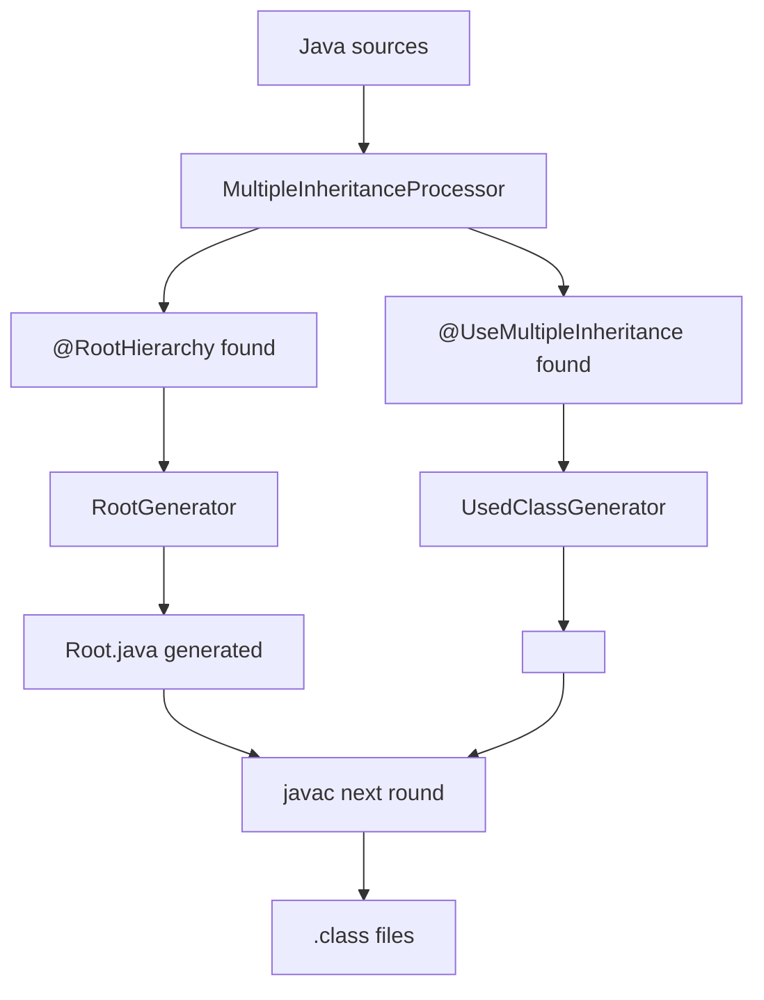

# Java Multiple Inheritance via Annotation Processing

Этот проект показывает, как эмулировать множественное наследование в Java через генерацию `.java` исходников во время компиляции.

## Что добавлено

- Аннотация `@UseMultipleInheritance` в `src/main/java/cyber/mi/annotations/UseMultipleInheritance.java`.
- Генератор `UsedClassGenerator` в `src/main/java/cyber/mi/processor/UsedClassGenerator.java`.
- Обновленный процессор `MultipleInheritanceProcessor`, который обрабатывает:
  - `@RootHierarchy`
  - `@UseMultipleInheritance`
- Постоянный пример в папке `smoke/`:
  - `SmokeRoot.java`
  - `SmokeA.java`
  - `SmokeB.java`
  - `SmokeMarker.java`
  - `SmokeRun.java`

## Как это работает

### 1) Root-интерфейс

Интерфейс помечается `@RootHierarchy`:

```java
@RootHierarchy
public interface SmokeRoot {
    String ping(String value);
}
```

Процессор генерирует `SmokeRootRoot` (абстрактный класс с инфраструктурой MRO):
- список `__mro`
- курсор `__mroCursor`
- методы `setMro(...)`, `currentNextTarget()`, `resetNextCursor()`

### 2) Marker-класс для MI

Класс помечается `@UseMultipleInheritance(root = ..., targets = {...})`:

```java
@UseMultipleInheritance(root = SmokeRoot.class, targets = {SmokeA.class, SmokeB.class})
public class SmokeMarker {}
```

Процессор генерирует `SmokeMarkerMI`:
- `extends smoke.SmokeRootRoot`
- конструктор принимает `SmokeA` и `SmokeB`, затем делает `setMro(...)`
- методы root-интерфейса делегируются в текущий target из MRO

### 3) Особенность compile-time чтения аннотаций

В `UsedClassGenerator` значения `root/targets` читаются через `AnnotationMirror + AnnotationValue + TypeMirror`.
Это важно: прямой вызов `annotation.root()` / `annotation.targets()` в annotation processor часто падает с `MirroredTypeException`.

## Диаграмма



## Пример из `smoke/` (оставлен в проекте)

- `SmokeRoot` — root-интерфейс.
- `SmokeA`, `SmokeB` — target-классы.
- `SmokeMarker` — marker для генерации `SmokeMarkerMI`.
- `SmokeRun` — запуск и проверка результата.

## Как запустить пример

Из корня `work`:

```bash
./gradlew classes
javac -cp build/classes/java/main -processor cyber.mi.processor.MultipleInheritanceProcessor -d smoke/out smoke/SmokeRoot.java
javac -cp build/classes/java/main:smoke/out -processor cyber.mi.processor.MultipleInheritanceProcessor -d smoke/out smoke/SmokeA.java smoke/SmokeB.java smoke/SmokeMarker.java smoke/SmokeRun.java
java -cp smoke/out smoke.SmokeRun
```

Ожидаемый вывод:

```text
A:hello
```

## Что фактически проверено

Проверка выполнена end-to-end:
- `./gradlew classes` — успешно.
- Генерация `SmokeRootRoot` — успешно.
- Генерация `SmokeMarkerMI` — успешно.
- Запуск `SmokeRun` — успешно, вывод `A:hello`.

